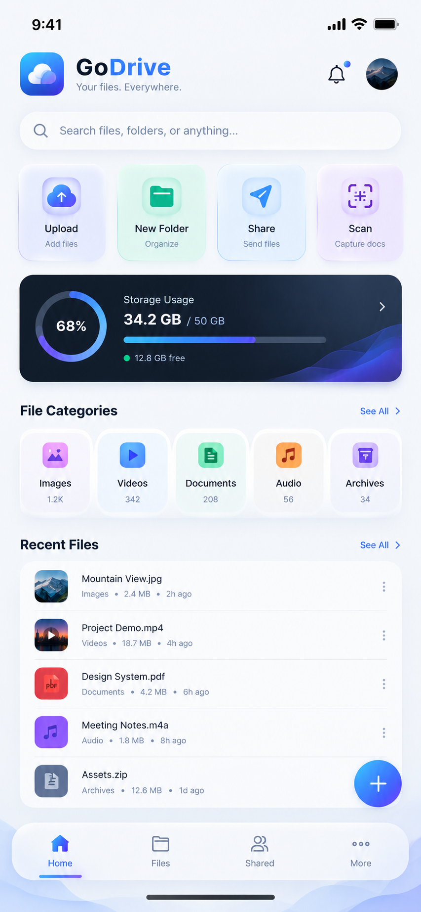
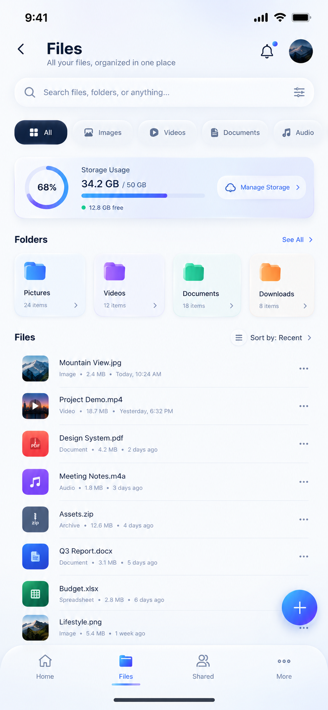
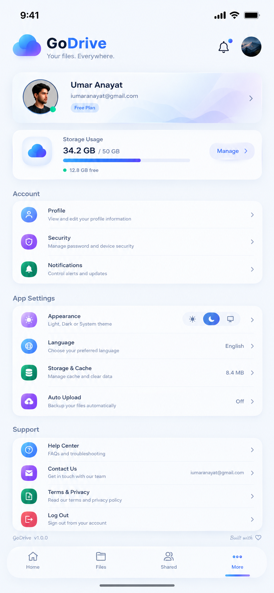

 

# GoDrive

### A file experience that feels like a product — not a folder picker

A calm, cloud-style workspace designed for everyday files.  
Browse, preview, share, and reclaim space without the friction of a desktop-era interface.

 

  

&nbsp;

 

---

 

### The Idea

> Storage should feel quiet, fast, and beautiful.  
> GoDrive was built for that standard.

**GoDrive** is a focused file workspace for everyday use.  
It brings browsing, previewing, sharing, and space management into one clean mobile experience — designed for clarity, speed, and the way people actually use their phones.

 

### What It Delivers

<table>
  <tr>
    <td width="50%" valign="top">

**Unified Home**  
Files and folders in one calm workspace

</td>
    <td width="50%" valign="top">

**Smart Organize**  
Upload, move, and sort without friction

</td>
  </tr>
  <tr>
    <td width="50%" valign="top">

**Rich Preview**  
Photos, video, audio, PDF, docs & sheets

</td>
    <td width="50%" valign="top">

**Share Ready**  
Send a file or create a shareable link

</td>
  </tr>
  <tr>
    <td width="50%" valign="top">

**Find Anything**  
Search, recents, and transfer tracking

</td>
    <td width="50%" valign="top">

**Always Yours**  
Offline copies and a recycle bin

</td>
  </tr>
  <tr>
    <td width="50%" valign="top">

**Admin Lens**  
Oversight for stored content when needed

</td>
    <td width="50%" valign="top">

**Product Polish**  
Built to feel like a shipped brand app

</td>
  </tr>
</table>

 

### Interface

  
  &nbsp;&nbsp;
  
  &nbsp;&nbsp;
  

  Designed for clarity and speed — premium UI captures

 

---

 

### Work With The Developer

**Umar Anayat** designs and ships Flutter products that feel intentional.  
Calm motion. Sharp UI. Features people actually use.

Looking to customize, white-label, or adapt this project to your brand?

 

&nbsp;

 

 